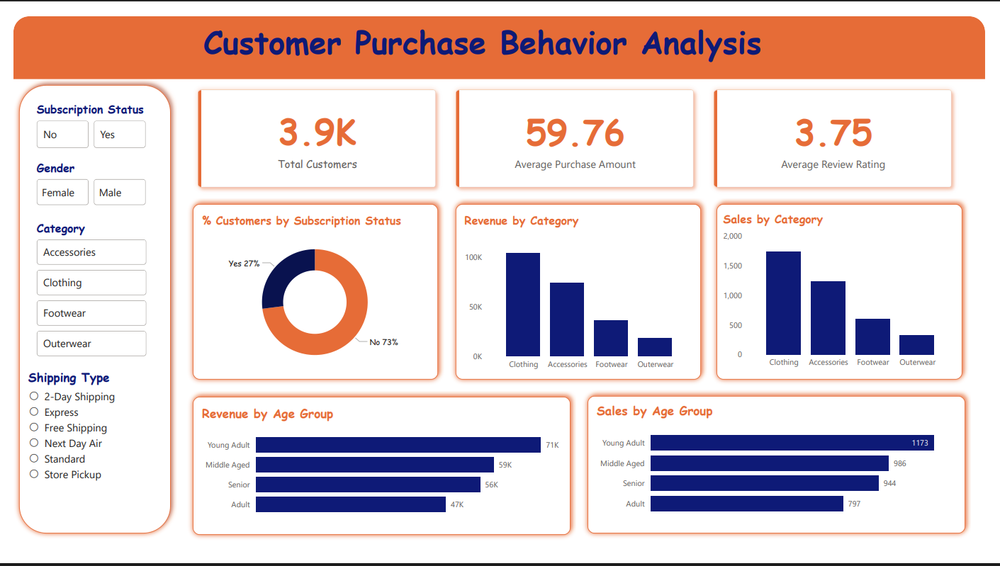

# Customer Shopping Behavior Analysis (SQL Portfolio Project)
## 1. Executive Summary

A leading retail company is experiencing changing customer purchasing patterns across demographics, product categories, and sales channels. To support data-driven decision-making, I analyzed the company’s consumer behavior dataset using SQL to uncover revenue trends, loyalty patterns, discount effectiveness, and subscription impact. The analysis revealed clear differences in spending behavior across customer segments, product performance driven by discounts, and strong revenue concentration within specific age groups and loyalty tiers. These insights provide a foundation for optimizing marketing strategy, customer engagement, and long-term revenue growth.

**Key Highlights:**

- Identified clear revenue differences across gender, age groups, and subscription status.
- Revealed products that are highly dependent on discounts for sales volume.
- Segmented customers into New, Returning, and Loyal categories for targeted retention strategies.

## 2. Business Problem

A leading retail company wants to better understand its customers’ shopping behavior in order to improve sales, customer satisfaction, and long-term loyalty. The management team has noticed changes in purchasing patterns across demographics, product categories, and sales channels (online vs. offline). They are particularly interested in uncovering which factors, such as discounts, reviews, seasons, or payment preferences, drive consumer decisions and repeat purchases.

**Central Business Question:**

*How can the company leverage consumer shopping data to identify trends, improve customer engagement, and optimize marketing and product strategies?*

This project uses SQL to turn raw transaction data into actionable business intelligence that supports strategic decision-making across marketing, sales, and customer experience teams.

## 3. Methodology
**Analytical Approach:**

Performed an end-to-end customer behavior analysis using transactional retail data.

Defined key performance indicators (KPIs) such as:

- Total Revenue
- Average Purchase Amount
- Discount Usage Rate
- Product Review Performance
- Customer Loyalty Segmentation
- Subscription Revenue Contribution

The primary deliverable is a structured SQL analysis that answers real-world business questions.

**Technical Implementation:**

- **Data Exploration:** Used SQL SELECT statements to inspect the structure and contents of the customers table.
- **Aggregation & Grouping:** Applied SUM, AVG, and COUNT functions to analyze revenue and customer behavior.
- **Conditional Logic:** Used CASE WHEN for customer segmentation and discount rate calculations.
- **Subqueries:** Used subqueries to compare individual spending behavior against overall averages.
- **Window Functions:** Applied ranking functions to identify top products within each category.
- **Common Table Expressions (CTEs):** Used CTEs for clean customer segmentation and ranked product analysis.

All analysis was performed entirely using SQL.

## 4. Skills & Tools Used

**Tools:**

- **SQL (MySQL / PostgreSQL compatible syntax)**

- **SQL Techniques Applied:**

  - GROUP BY, ORDER BY
  - SUM, AVG, COUNT
  - CASE WHEN
  - Subqueries
  - Window Functions (RANK())
  - Common Table Expressions (CTEs)

- **Business Concepts Applied:**

  - Revenue Analysis
  - Customer Segmentation
  - Discount Effectiveness
  - Product Performance Analysis
  - Subscription Impact Assessment
  - Demographic Revenue Contribution

## 5. Results & Business Recommendations
**Key Results:**

- **Revenue by Gender:** Clear revenue differences were observed between male and female customers, indicating important demographic spending trends.
- **High-Value Discount Customers:** Some customers continue to spend above the company’s average purchase amount even when using discounts, indicating strong revenue potential without heavy price sensitivity.
- **Product Performance:** The top 5 highest-rated products highlight which items deliver the strongest customer satisfaction.
- **Shipping & Spending Behavior:** Spending patterns differ between Standard and Express shipping users, showing how logistics choices influence revenue.
- **Subscription Impact:** Subscribed customers show distinct spending behavior and revenue contribution compared to non-subscribers.
- **Discount-Driven Products:** Certain products rely heavily on discounts for sales volume, posing potential margin risks.
- **Customer Loyalty Segmentation:** Customers were successfully classified into New, Returning, and Loyal groups for retention strategy development.
- **Category Leaders:** The top 3 most purchased products were identified within each category.
- **Repeat Buyers & Subscriptions:** A clear relationship exists between repeat purchases and subscription status.
- **Revenue by Age Group:** Specific age groups contribute a disproportionately high share of total revenue.

**Business Recommendations:**

1.  **Strengthen Loyalty Programs:**
Focus marketing and retention strategies on Returning and Loyal customers to increase lifetime value.

2. **Optimize Discount Strategy:**
Reduce over-reliance on discounts for products with high discount-driven sales to protect profit margins.

3. **Product Investment Strategy:**
Prioritize inventory and marketing spend on top-rated and top-selling products within each category.

4. **Subscription Growth Strategy:**
Leverage repeat buyer behavior to drive targeted subscription promotions.

5. **Demographic Targeting:**
Tailor marketing campaigns based on high-revenue age groups and gender segments to maximize ROI.

## 6. Next Steps (Future Enhancements)

Deeper customer segmentation using advanced loyalty scoring.

1. Time-series analysis for seasonal purchasing trends.

2. Integration with visualization tools such as Power BI or Tableau.

3. Customer Lifetime Value (CLV) modeling.

4. Automated reporting pipelines.
